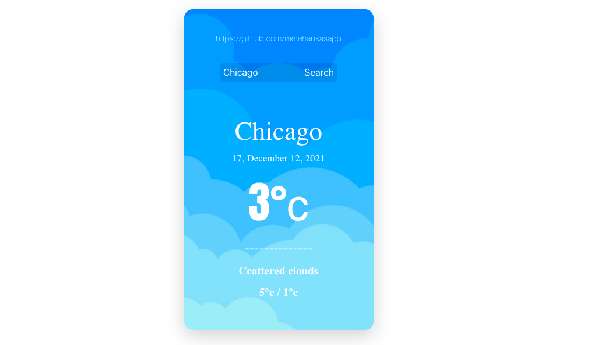

Hi ! Today I coded a weather app design I found on the internet using React and Weather API.

## Screenshot

## <b>Application usage:</b>

By searching the name of the city or district you want, you can see the instantaneous weather conditions and the maximum minimum weather conditions.

## <b>Technologies I use: </b>

1-React  
3-Bootstrap

## <b>Weather API : https://openweathermap.org/api</b>

Totally Responsive!

Project Demo: https://react-weather-app-509e1.web.app/ 
Project Source Code: https://github.com/metehankasapp/weather-app-react

